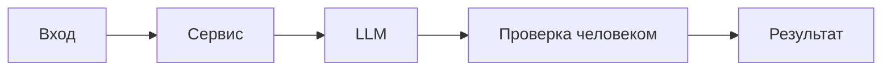

# ADR: решение для первого рабочего сценария

- Статус: accepted
- Дата: 2026-09-06
- Ответственные: команда backend (practice_01)

## Контекст

По TRAINING_PR.diff добавлен первый рабочий сценарий: сервис на FastAPI принимает JSON с ключом `diff`, формирует prompt вида `"Review this pull request and find problems:\n" + diff`, вызывает `LLM.generate(prompt)` и возвращает результат как `{"comment": <ответ LLM>}`. Эндпоинт: `POST /api/reviews`, обработчик обращается к `review_service.review(payload["diff"])` без явной валидации входа и обработки исключений вызова LLM.
## Решение

Минимально реализовать путь запроса для ревью diff через LLM:

- В `ReviewService` добавить метод `review(diff: str) -> dict[str, str]`, который формирует prompt и вызывает `self.llm.generate`.
- В FastAPI добавить `POST /api/reviews`, принимающий `payload: dict` и передающий `payload["diff"]` в сервис.

Это обеспечивает быстрый первый результат без дополнительных слоёв валидации и обработки ошибок.
## Рассмотренные альтернативы

| Альтернатива | Почему не выбрали сейчас |
|---|---|
| Pydantic‑модель запроса (`BaseModel` с полем `diff: str`) | Усложняет первый инкремент; в TRAINING_PR.diff не предусмотрено |
| Обёртка вызова LLM с таймаутом и `try/except` | В первый инкремент не входит; не отражено в TRAINING_PR.diff |
| Предобработка/нормализация diff перед включением в prompt | Не требуется для демонстрации сценария; отсутствует в TRAINING_PR.diff |

## Последствия и главный риск

- Положительные последствия: простой и предсказуемый путь запроса; минимальные изменения кода; быстрый доступ к первому результату.
- Ограничения: отсутствие валидации входа (доступ по ключу `payload["diff"]`), отсутствие обработки исключений и таймаутов LLM, сырые данные diff попадают в prompt без фильтрации.
- Главный риск: сырой `diff` вставляется в prompt и отправляется в LLM; дополнительно при отсутствии ключа `diff` возможен `KeyError` и 500 от сервера.
- Как проверим риск: unit‑тест на формирование prompt (проверяет включение сырого diff), HTTP‑проверка `POST /api/reviews` без `diff` (ожидаем ошибка сервера в текущем виде), интеграционный тест с LLM, бросающим исключение (исключение не перехватывается).

Примечание по инкрементам: обработка исключений и таймаутов LLM, а также валидация входа намеренно не входят в первый инкремент и будут добавлены в следующих изменениях; текущие риски зафиксированы в тестах и проверках выше.

## Архитектурная схема

## Как использовали AI

- Для чего: сформулировать решение первого инкремента и выделить риски по строкам TRAINING_PR.diff.
- Тип промпта: zero‑shot (P1-01) → master prompt (P1-02) → исполняющий промпт (P1-03).
- Строка в [`prompts.md`](prompts.md): P1-01, P1-02, P1-03.
- Что проверили и исправили сами: сопоставили риски строкам diff (`app/review_service.py:19-22`, `app/api.py:35-38`), исключили предположения вне diff.
