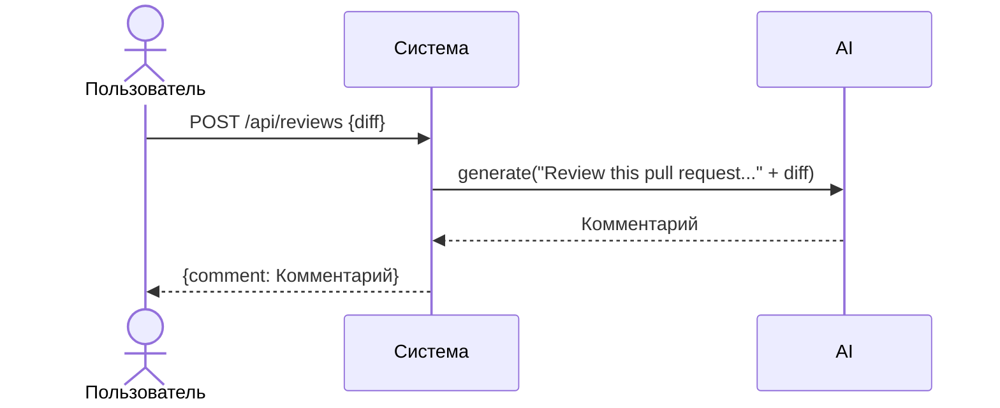

# Use cases и user stories

## Первый рабочий сценарий

**Когда** клиент отправляет `POST /api/reviews` с JSON, содержащим ключ `diff`, **система** формирует prompt из сырого `diff`, вызывает `LLM.generate` и возвращает `{"comment": <ответ LLM>}`, **а пользователь получает** текстовый комментарий по diff.

Не входит в этот сценарий:

- Валидация схемы и типов тела запроса
- Обработка таймаутов и ошибок LLM
- Аутентификация и лимиты размера входа

## Use case

| Поле | Значение |
|---|---|
| Актор | Клиент сервиса (внутренний потребитель API) |
| Триггер | HTTP‑запрос `POST /api/reviews` с телом `{"diff": "..."}` |
| Предусловия | Сервис запущен; доступен эндпоинт `/api/reviews`; передан ключ `diff` |
| Основной результат | Возвращён JSON `{"comment": <строка из LLM>}` |
| Ошибка или отказ | Отсутствует ключ `diff` → `KeyError` и ошибка сервера; исключение из `LLM.generate` не перехватывается |



## User stories и acceptance criteria

```gherkin
Feature: Ревью diff через API

  Scenario: Позитивный
    Given запущен сервис FastAPI
    And доступен эндпоинт POST /api/reviews
    When я отправляю JSON с ключом diff и текстом "test"
    Then ответ содержит JSON с ключом comment
    And comment является строкой

  Scenario: Негативный или граничный
    Given запущен сервис FastAPI
    When я отправляю JSON без ключа diff
    Then сервер возвращает ошибку (в текущем виде 500 из-за KeyError)
```

## Как использовали AI

- Для чего: сформулировать сценарий и критерии приёмки строго по TRAINING_PR.diff.
- Тип промпта: master prompt и P1-03.
- Строка в [`prompts.md`](prompts.md): P1-02, P1-03.
- Что проверили и исправили сами: согласовали формулировки с кодом из diff; не добавляли неподтвержденные требования.
