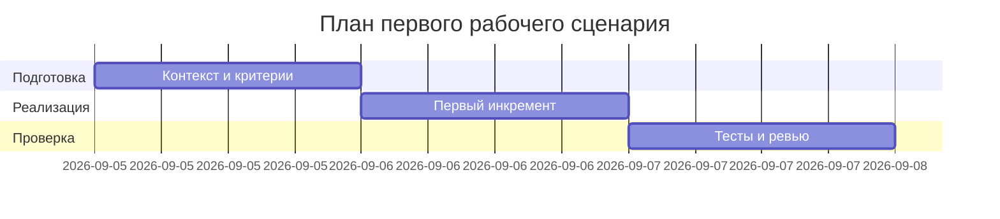

# План поставки

## Инкременты и ответственность

| Инкремент | Наблюдаемый результат | Что делает человек | Что делает AI или субагент | Проверка | Зависимости |
|---|---|---|---|---|---|
| 1 | Рабочий эндпоинт POST /api/reviews и метод review | Поднимает сервис, проверяет ручным запросом | Генерирует чек‑лист и артефакты tests_* | Ответ 200 с `{comment: ...}` при валидном JSON | TRAINING_PR.diff |
| 2 | Документированные проверки (unit, integration, e2e) | Пишет тест‑кейсы согласно артефактам | Помогает сформулировать сценарии и expected | Проход позитивного кейса, фиксируем поведение негативных | Инкремент 1 |
| 3 | Ревью рисков и план next steps | Проводит ревью и планирует улучшения | Сводит риски и evidence | Таблица рисков согласована | Инкремент 2 |

## Диаграмма Ганта

Замените даты и задачи на свой план.

## Как использовали AI

- Для чего: зафиксировать инкременты и проверки вокруг первого сценария.
- Тип промпта: master prompt и P1-03.
- Строка в [`prompts.md`](prompts.md): P1-02, P1-03.
- Что проверили и исправили сами: синхронизировали формулировки с TRAINING_PR.diff и артефактами product/analysis.
